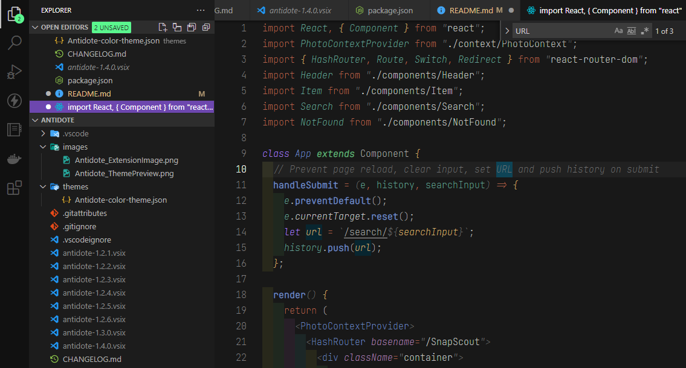

Antidote is an enhanced dark theme designed to improve the overall coding experience.

### Feature Request/Issue

Please [open an issue](https://github.com/philecker/antidote/issues), if you have a feature request, or found a bug to report.

### Recommended
#### Extensions
[Bracket Pair Colorizer 2](https://marketplace.visualstudio.com/items?itemName=CoenraadS.bracket-pair-colorizer-2)

    "bracket-pair-colorizer-2.colors":  [
    	"#ddb977",  // Yellow/Gold
    	"#7791c3",  // Blue
    	"#a88fd1"  // Purple
    ],
    "bracket-pair-colorizer-2.colorMode":  "Consecutive",
    "bracket-pair-colorizer-2.showBracketsInGutter": true,
    "bracket-pair-colorizer-2.activeScopeCSS":  [
    	"borderStyle : solid",
    	"borderWidth : 1px",
    	"borderColor : {color}",
    	"opacity: 0.5"
    ]
#### Font

[JetBrains Mono](https://www.jetbrains.com/lp/mono/)

    "editor.fontFamily":  "JetBrains Mono Thin",
    "editor.fontLigatures": true

### Supported Languages

* HTML
* CSS
* JavaScript
* JSX
* JSON
* TypeScript (Partial Support)
* Jest (Partial Support)
* Dockerfile (Partial Support)
* Markdown (Partial Support)
* Sass/SCSS (Partial Support)
* Less (Partial Support)
* C# (Partial Support)
* Handlebars (Partial Support)
* Java (Partial Support)
* Python (Partial Support)